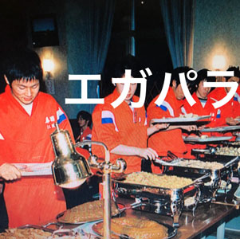
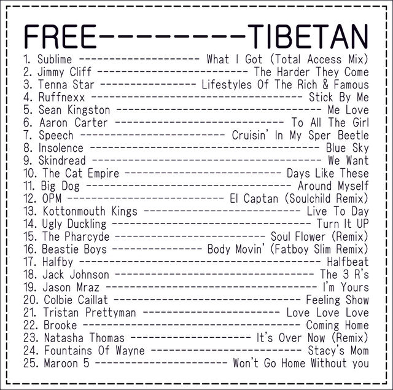
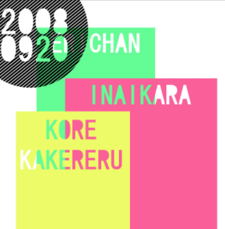
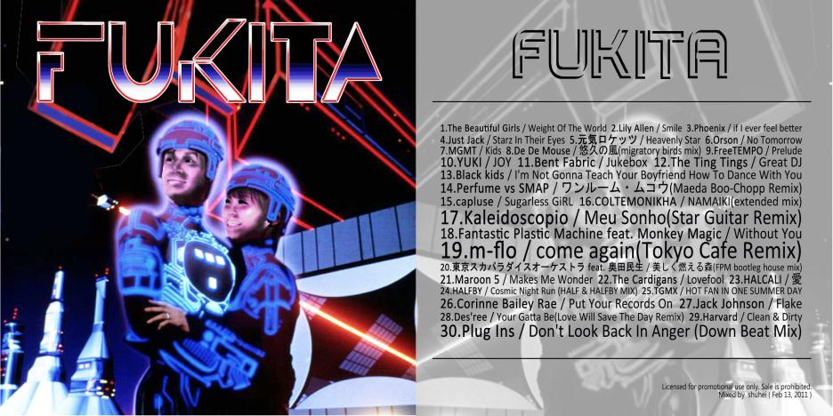

--------------
**New release!**  

[アスタがあるさ](https://soundcloud.com/user-266059752/wpsuv1omfqn0) 

Special thanks : art by [Toyameg](https://www.instagram.com/_toyameg_/) and mastering(and more) by [iSOP](https://www.isop-info.com/)

--------------

## Mix

|タイトル|リリース|ストリーミング|ダウンロード†|
|:--|:--|:--|:--|
|[batta2](#batta2)|2005.9.9|[SoundCloud](https://soundcloud.com/shuheiyamamotojapan/batta2){:target="_blank"}||
|[エガパラ](#egapara)|2007.4.12|[SoundCloud](https://soundcloud.com/user-282021944/plmhpiepabgn){:target="_blank"}|
|[THREE RUB HALF](#3rub5)|2007.7.30|[SoundCloud](https://soundcloud.com/shuheiyamamotojapan/3rub5-1){:target="_blank"}||
|[free tibetan](#freetibetan)|2008.8.20|[SoundCloud](https://soundcloud.com/user-869116356/free-tibetan){:target="_blank"}||
|[EIKK](#eikk)|2008.9.20|[SoundCloud](https://soundcloud.com/user-869116356/eikk){:target="_blank"}||
|[mitsubishi](#mitsubishi)|2010.11.16|[SoundCloud](https://soundcloud.com/user-282021944/mitsubishi){:target="_blank"}||
|[fukita](#fukita)|2011.2.13|[SoundCloud](https://soundcloud.com/user-869116356/fukita){:target="_blank"}||
|[アスタがあるさ](#aste) |2018.8.15|[SoundCloud](https://soundcloud.com/user-266059752/wpsuv1omfqn0){:target="_blank"}||

† splitは曲ごとにトラックが分かれています。

## セットリスト

### batta2  (1:19:33)

|#|アーティスト|タイトル|
|--:|:--|:--|
|1|POINT BREAK|DO WE ROCK|
|2|FIVE|WE WILL ROCK YOU|
|3|OLYMPIC LIFTS|OLYMPIC LIFTS|
|4|BAD RONALD|Popcorn Titties|
|5|BEASTIE BOYS|BODY MOVIN' (Fatboy Slim Remix)|
|6|BRASSY|I CAN'T WAIT|
|7|METHODS OF MAYHEM (featuring LIL' KIM, GEORGE CLINTN, MIX MASTE MIKE, FRED DURST) |GET NAKED|
|8|X-ECUTIONERS (featuring Rob Zombie, Slug from Atmosphere and Josey Scott)|(Even) More Human Than Human|
|9|BAGGA BOWNZ|Life's A Bitch|
|10|FAITH NO MORE & BOO-YAA T.R.I.B.E|ANOTHER BODY MURDERED|
|11|MINDLESS SELF INDULGENCE|BULLXXXT|
|12|RAGE AGAINST THE MACHINES|GUERRILA RADIO (Radio Edit)|
|13|KOTTONMOUTH KINGS|DAY DREAMIN' FAZES|
|14|PHUNK JUNKEEZ|B-BOY HARD|
|15|FIST FUNK|BOB YOUR HEAD|
|16|CROSSCUT|SPIT THE FIRE|
|17|LINKIN PARK|NUMB|
|18|DUB WAR|Strike It ("NINE TO SIX" Remix)|
|19|VELCRA|TEST ANIMALS (THE AMYGDALA Mix)|
|20|QUEST|KILLAR (Megaherz Remix)|
|21|WHITE ZOMBIE|BLUR THE TECHNICOLOR (Poker From Stud To Strip Mix)|
|22|MC LARS|iGENERATION|
|23|SILMARILS|TANT QUE PARLE L'ECONOMIE|
|24|WATCHA|DEAD MAN (IS A GOOD MAN)|
|25|pleymo|NEW WAVE|
|26|ENHANCER|peu importe|
|27|2 SKINNEE J'S|LOST & FOUND|
|28|CREDIT TO THE NATION|one by one|
|29|Michael Franti & Spearhead w/Gift of Gab|What I Got|
|30|Grasshopper Takeover|Save Yourself|
|31| two ball loo|Debu(Demo)|

### エガパラ  (1:16:51)

|#|アーティスト|タイトル|リリース|
|--:|:--|:--|:--|
|1|DREAMS COME TRUE|サンキュ|1995.2.22|
|2|蓮井朱夏|ZOO 〜愛をください〜|2000.9.7|
|3|猿岩石|白い雲のように|1996.12.21|
|4|財津和夫|サボテンの花〜ひとつ屋根の下より〜|1993.4.28|
|5|キンモクセイ|二人のアカボシ|	2002.1.9|
|6|松浦亜弥|ドッキドキ!LOVEメール|2001.4.11|
|7|SMAP|ダイナマイト|1997.2.26|
|8|JUDY AND MARY|くじら12号|1997.2.21|
|9|シャ乱Q|ズルい女|1995.5.3|
|10|大黒摩季|熱くなれ|1996.7.8|
|11|TRF|CRAZY GONNA CRAZY|1995.1.1|
|12|野猿|叫び|1998.9.17|
|13|ブラックビスケッツ|Timing|1998.4.22|
|14|森高千里|私がオバさんになっても|1992.6.25|
|15|DEEN|ひとりじゃない|1996.4.15|
|16|ZARD|Don't You See|1997.1.6|
|17|桑田佳祐|波乗りジョニー|2001.7.4|
|18|PUFFY|愛のしるし|1998.3.14|
|19|小沢健二|愛し愛されて生きるのさ|1994.8.31|
|20|福山雅治|桜坂|2000.4.26|
|21|SAMP|オレンジ|2000.8.30|
|22|CHEMISTRY|PIECES OF A DREAM|2001.3.7|
|23|槇原敬之|もう恋なんてしない|1992.5.25|
|24|安室奈美恵|Don't wanna cry|1996.3.13|

### THREE RUB HALF (1:18:24)

|#|アーティスト|タイトル|リリース|
|--:|:--|:--|:--|
|1|山崎まさよし|セロリ|1996.9.1|
|2|小沢健二|ラブリー|1994.11.23|
|3|小沢健二|痛快ウキウキ通り|1995.12.20|
|4|斉藤和義|歩いて帰ろう|1994.6.1|
|5|サザンオールスターズ|太陽は罪な奴|1996.6.25|
|6|広末涼子|MajiでKoiする５秒前|1997.7.15|
|7|JUDY AND MARY|散歩道|1998.2.11|
|8|ZARD|MY FRIEND|1996.1.8|
|9|DEEN|瞳そらさないで|1994.6.22|
|10|キタキマユ|ドゥー・ユー・リメンバー・ミー|2001.2.15|
|11|椎名林檎|幸福論|1998.5.27|
|12|森高千里|気分爽快|1994.1.31|
|13|PUFFY|渚にまつわるエトセトラ|1997.4.16|
|14|SMAP|SHAKE|1996.11.18|
|15|SPEED|Go!Go!Heaven|1997.3.26|
|16|安室奈美恵|a walk in the park|1996.11.27|
|17|Every Little Thing|Dear My Friends|1997.1.22|
|18|B'z|愛のままにわがままに 僕は君だけを傷つけない|1993.3.17|
|19|松浦亜弥|LOVE涙色|2001.9.5|
|20|Mr.Children|星になれたら|1992.12.1|
|21|織田裕二|OVER THE TROUBLE|1994.7.8|
|22|大黒摩季|ら・ら・ら|1995.2.20|
|23|aiko|ボーイフレンド|2000.9.20|
|24|class|夏の日の1993|1993.4.21|
|25|My Little Lover|HELLO, Again～昔からある場所～|1995.8.21|
|26|スピッツ|チェリー|1996.4.10|
|27|オリジナル・ラブ|接吻 kiss|1993.11.10|
|28|はっぴいえんど|風をあつめて|1971.11.20|

### free tibetan (1:05:46)

|#|アーティスト|タイトル|
|--:|:--|:--|
|1| Sublime | What I Got (Total Access Mix) |
|2| Jimmy Cliff | The Harder They Come |
|3| Tenna Star | Lifestyles Of The Rich & Famous |
|4| Ruffnexx | Stick By Me |
|5| Sean Kingston | Me Love |
|6| Aaron Carter | To All The Girl |
|7| Speech | Cruisin' In My Sper Beetle |
|8| Insolence | Blue Sky |
|9|Skindread | We Want |
|10| The Cat Empire | Days Like These |
|11| Big Dog | Around Myself |
|12| OPM | El Captan (Soulchild Remix) |
|13| Kottonmouth Kings | Live To Day |
|14| Ugly Duckling | Turn It UP |
|15| The Pharcyde | Soul Flower (Remix) |
|16| Beastie Boys | Body Movin' (Fatboy Slim Remix) |
|17| Halfby | Halfbeat |
|18| Jack Johnson | The 3 R's |
|19| Jason Mraz -I'm Yours |
|20| Colbie Caillat | Feeling Show |
|21| Tristan Prettyman | Love Love Love |
|22| Brooke | Coming Home |
|23| Natasha Thomas | It's Over Now (Remix) |
|24| Fountains Of Wayne | Stacy's Mom |
|25| Maroon 5 | Won't Go Home Without you |

### EIKK (1:05:44)

|#|アーティスト|タイトル|
|--:|:--|:--|
|1 | CSS | Alala (Bonde Do Role Remix)
|2 | Bonde Do Role | Gasolina|
|3 | Northern State | Good Distance|
|4 | The Stone Roses Vs. Grooveride | Fools Gold (Grooverider Mix)|
|5 | Tim Deluxe | It Just Won't Do|
|6 | Sly Mongoose | Snakes And Ladder (Rub N Tug Remix)|
|7 | Fantastic Plastic Machine | Beautiful Days feat. Yoshie Nakano (EGO-WRAPPIN') & Heaven L. Clayborne|
|8 | Feist | 1,2,3,4 (Van She Tech Remix)|
|9 | Basement Jaxx | Red Alert|
|10| Dragonette | I Get Around (Midnight Juggernauts Remix)|
|11| Daft Punk | Harder, Better, Faster, Stronger|
|12| Royksopp | Eple (Boris & Michi's Radio Edit)|
|13| Junkie XL | No Way|
|14| Groove Armada | Get Down|
|15| The Chemical Brothers | Get Yourself Down|
|16| Freestylers | Beat It Down|
|17| Fatboy Slim | Champion Sound (Digital Dog Remix)|
|18| Atomic Hooligan | Head|
|19| The Prodigy | Girls|
|20| Olav Basoski feat. Mitchie One | Waterman|
|21| Wildchild | Renegade Master (Fatboy Slim Old Skool Mix)|
|22| Incredible Bongo Band | Apache|
|23| Bloomingdales | Tighten Rap|
|24| Aldo Vanucci | Big Dogs Rok "Witch Comix" (Mr. Comicstore Remix)|
|25| Daft Punk | digital Love|
|26| Kylie Minogue | Wow|
|27| Hellogoodbye | Here (In Your Arms) (Tommie Sunshine Robots Up Radio Remix)|

### mitsubishi (1:11:19)

|#|アーティスト|タイトル|
|--:|:--|:--|
|1|Asobi Seksu|Everything Is On |
|2|Childs|Mariana|
|3|Caroline|Drove Me To The Wall|
|4|Mogwai|Acid Food|
|5|Masha Qrella|I Can't Tell|
|6|Lily Chou-Chou|アラベスク|
|7|Juana Molina|El Pastor Mentiroso|
|8|Bonobo|Days To Come (Feat. Bajka)|
|9|Tommy Guerrero|No Time For Time|
|10|This Wil Destroy You|Grandfather Clock|
|11|4 Bonjour's Parties|Nostalgic Was Broken To Pieces|
|12|Kazumasa Hashimoto|Drama|
|13|World's End Girlfriend|Birthday Resistance|
|14|The Album Leaf|Always For You|
|15|I Am Robot And Proud|The Work|
|16|Four Tet|She Moves She|
|17|Psapp|Tiger, My Friend|
|18|Mum|Don't Be Afraid, You Have Just Go|
|19|Spangle Call Lilli Line|Crawl|
|20|Epic45|River Traffic|
|21|Toe|C|
|22|The Player Piano|Milwaukee Mile|
|23|te'|及ばざる時は速やかに止むるを『智』と言うべし。|
|24|Envy|Shield Of Selflessness|

### fukita (1:19:51)

|#|アーティスト|タイトル|
|--:|:--|:--|
|1|The Beautiful Girls | Weight Of The World  |
|2|Lily Allen | Smile  |
|3|Phoenix | if I ever feel better|
|4|Just Jack | Starz In Their Eyes  |
|5|元気ロケッツ | Heavenly Star  |
|6|Orson | No Tomorrow|
|7|MGMT | Kids  |
|8|De De Mouse | 悠久の風(migratory birds mix)  |
|9|FreeTEMPO | Prelude|
|10|YUKI | JOY  |
|11|Bent Fabric | Jukebox  |
|12|The Ting Tings | Great DJ|
|13|Black kids | I'm Not Gonna Teach Your Boyfriend How To Dance With You|
|14|Perfume vs SMAP | ワンルーム・ムコウ(Maeda Boo-Chopp Remix)|
|15|capluse | Sugarless GiRL  |
|16|COLTEMONIKHA | NAMAIKI(extended mix)|
|17|Kaleidoscopio | Meu Sonho(Star Guitar Remix)|
|18|Fantastic Plastic Machine feat. Monkey Magic | Without You|
|19|m-flo | come again(Tokyo Cafe Remix)|
|20|東京スカパラダイスオーケストラ feat. 奥田民生 | 美しく燃える森(FPM bootleg house mix)|
|21|Maroon 5 | Makes Me Wonder  |
|22|The Cardigans | Lovefool  |
|23|HALCALI | 愛|
|24|HALFBY | Cosmic Night Run (HALF & HALFBY MIX)  |
|25|TGMX | HOT FAN IN ONE SUMMER DAY|
|26|Corinne Bailey Rae | Put Your Records On  |
|27|Jack Johnson | Flake|
|28|Des'ree | Your Gatta Be(Love Will Save The Day Remix)  |
|29|Harvard | Clean & Dirty|
|30|Plug Ins | Don't Look Back In Anger (Down Beat Mix)|

### アスタがあるさ (2:13:01)

|#|アーティスト|タイトル|リリース|
|--:|:--|:--|:--|
|1||Intro||
|2|Superfly|Hi-Five|2008.4.23|
|3|斉藤和義|ずっと好きだった|2010.4.21|
|4|相川七瀬|Sweet Emotion|1997.5.1|
|5|広末涼子|ジーンズ ～1999Mix～|1998.10.7|
|6|THE YELLOW MONKEY|プライマル。|2001.1.31|
|7|川本真琴|1/2|1997.3.21|
|8|竹内 まりや|家に帰ろう|1992.11.10|
|9|織田哲郎 |いつまでも変わらぬ愛を|1992.3.25|
|10|米米CLUB|君がいるだけで|1992.5.4|
|11|Every Little Thing|出逢った頃のように|1997.8.6|
|12|小松未歩|謎|1997.5.28|
|13|モーニング娘。|ザ☆ピ～ス！|2001.7.25|
|14|SMAP|青いイナズマ|1996.7.15|
|15|藤井隆|ナンダカンダ|2000.3.8|
|16|YUKI|Joy|2005.1.19|
|17|中島美嘉|CRESCENT MOON|2002.2.6|
|18|MANISH|煌めく瞬間に捕われて|1995.2.6|
|19|Whiteberry|夏祭り|2000.8.9|
|20|aiko|桜の時|2000.2.17|
|21|槇原敬之|どうしようもない僕に天使が降りてきた|1996.9.25|
|22|濱田理恵|笑顔に会いたい|1994.4.21|
|23|一青窈|ハナミズキ|2004.2.11|
|24|中西保志|最後の雨|1992.8.10|
|25|the brilliant green|冷たい花|1998.8.26|
|26|オリジナル・ラブ|STARS|1999.2.3|
|27|Rumania Montevideo|Still For Your Love|1999.4.14|
|28|Do As Infinity|深い森|2001.6.27|
|29|エレファントカシマシ|風に吹かれて|1997.11.7|
|30|福耳|星のかけらを探しに行こう Again|1999.7.14|
|31|My Little Lover|白いカイト|1995.7.3|
|32|福山雅治|虹|2003.8.27|
|33|椎名林檎|丸の内サディスティック|1999.2.24|
|34|サザン・オールスターズ|愛の言霊～Spiritual Message～|1996.5.20|
|35|Kinki Kids|ボクの背中には羽根がある|2001.2.7|
|36|スピッツ|ロビンソン|1995.4.5|
|37|ZYYG , REV , ZARD & WANDS featuring. 長嶋茂雄|果てしない夢を|1993.6.9|
|38|花＊花|あ～よかった|1999.6.4|
|39|川嶋あい|明日への扉|2003.2.14|
|40|中川翔子|綺麗ア・ラ・モード|2008.10.22|
|41|Mr.Children|ひびき|2006.11.15|
|42|時給８００円|死ぬほどあなたが好きだから|2003.7.23|
|43|H Jungle with t|GOING GOING HOME|1995.7.19|
|44|ウルフルズ|明日があるさ|2001.2.16|
|45|小沢健二|天使たちのシーン|1993.9.29|

